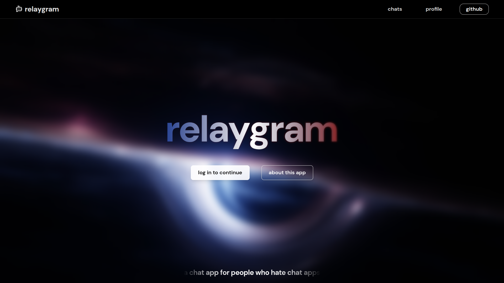

# Relaygram

Relaygram is a real-time chat application built with the MERN stack, featuring low-latency messaging powered by Socket.IO and AI-assisted message generation using Google Gemini.

## Screenshot

## Features
- Real-time messaging with WebSockets (Socket.io)
- AI-powered instant message generation (Gemini)
- One-to-one and group chats
- Typing indicators and user presence
- Clean, responsive UI built with Shadcn/UI

## Tech Stack
- React
- Node.js & Express
- MongoDB
- Socket.IO
- Google Gemini
- shadcn/ui + Tailwind CSS

## Purpose
This project was built to demonstrate full-stack development with MERN, real-time communication, and practical AI integration in a modern web application.
